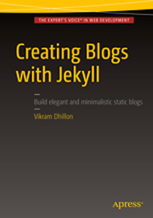

[](https://gitpitch.com/enogrob/ebook-service-oriented-design-with-ruby-on-rails/master)
```
Roberto Nogueira  
BSd EE, MSd CE
Solution Integrator Experienced - Certified by Ericsson
```
# eBook Service Oriented Design with Ruby on Rails



**About**

Learn everything you need to about the subject of this `eBook` project.

[Homepage](http://www.informit.com/store/service-oriented-design-with-ruby-and-rails-9780321659361)

## Topics
```
[x] Foreword
[x] Preface
[x] Acknowledgments
[x] About the Author

Chapter 1: Implementing and Consuming Your First Service
[x] What’s a Service?
[x] Service Requirements
[x] The Ruby Tool Set
[ ] The User Service Implementation
[ ] Implementing the Client Library
[ ] Putting It All Together
[ ] Conclusion

Chapter 2: An Introduction to Service-Oriented Design
[ ] Use of Service-Oriented Design in the Wild
[ ] Service-Oriented Design Versus Service-Oriented Architecture Versus
[ ] RESTful-Oriented Architecture
[ ] Making the Case for Service-Oriented Design
[ ] Conclusion

Chapter 3: Case Study: Social Feed Reader
[ ] A Typical Rails Application
[ ] The Rails Social Feed Reader Application
[ ] Converting to Services
[ ] Conclusion

Chapter 4: Service and API Design
[ ] Partitioning Functionality into Separate Services
[ ] Versioning Services
[ ] URIs and Interface Design
[ ] Successful Responses
[ ] Error Responses
[ ] Handling Joins
[ ] API Complexity
[ ] Conclusion

Chapter 5: Implementing Services
[ ] The Vote Service
[ ] Models
[ ] Rails
[ ] Sinatra
[ ] Rack
[ ] Conclusion

Chapter 6: Connecting to Services
[ ] Blocking I/O, Threading, and Parallelism
[ ] Typhoeus
[ ] Multi-threaded Requests
[ ] JRuby
[ ] Logging for Performance
[ ] Handling Error Conditions
[ ] Testing and Mocking Service Calls
[ ] Requests in Development Environments
[ ] Conclusion

Chapter 7: Developing Service Client Libraries
[ ] Packaging
[ ] Parsing Logic
[ ] ActiveModel
[ ] Connection and Request Logic
[ ] Mocks, Stubs, and Tests
[ ] Conclusion

Chapter 8: Load Balancing and Caching
[ ] Latency and Throughput
[ ] Load Balancing
[ ] Caching with Memcached
[ ] HTTP Caching
[ ] Conclusion

Chapter 9: Parsing XML for Legacy Services
[ ] XML
[ ] SOAP
[ ] Conclusion

Chapter 10: Security
[ ] Authentication
[ ] Authorization
[ ] Encryption
[ ] Conclusion

Chapter 11: Messaging
[ ] What Is Messaging?
[ ] RabbitMQ and AMQP
[ ] Synchronous Reads, Asynchronous Writes
[ ] The CAP Theorem
[ ] Data Is the API
[ ] Conclusion

Chapter 12: Web Hooks and External Services
[ ] Web Hooks
[ ] OAuth
[ ] Integrating with External Services
[ ] Ensuring Performance and Reliability
[ ] Conclusion

[ ] Appendix: RESTful Primer
[ ] Roy Fielding’s REST
[ ] REST and Resources
[ ] HTTP and the Uniform Interface
[ ] Conclusion
```
